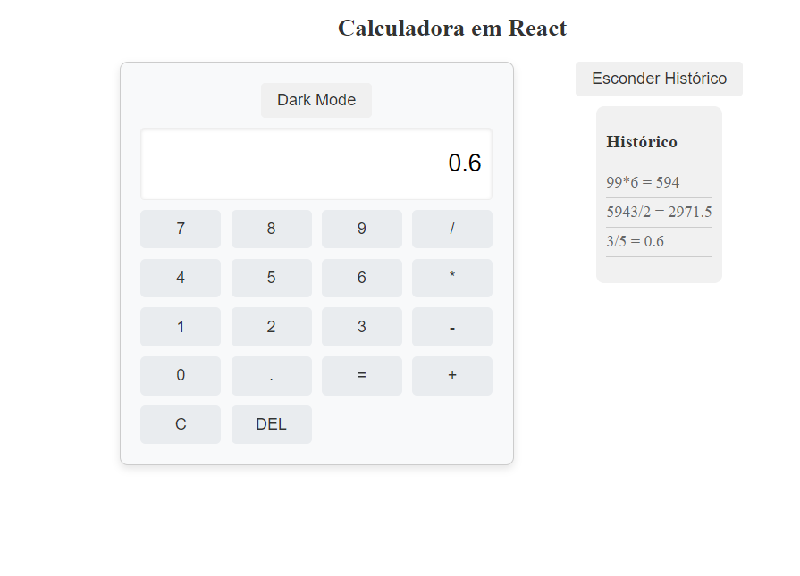
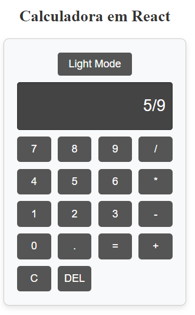

# App Calculadora React

[](https://opensource.org/licenses/MIT)

Este projeto é uma calculadora construída utilizando React. Ela suporta operações aritméticas básicas como adição, subtração, multiplicação e divisão, e oferece funcionalidades como um modo claro e escuro para melhorar a experiência do usuário.

## Funcionalidades

- Realiza operações aritméticas básicas.
- Alternância entre modo claro e escuro.
- Validação de entrada para prevenir erros comuns, como múltiplos operadores consecutivos.

## Tecnologias Utilizadas

- React
- CSS para estilização
- GitHub para versionamento e hospedagem do código

## Instalação

Para instalar e executar este projeto localmente, siga estas etapas:

1. Clone o repositório:

    ```bash
    git clone https://github.com/reginaldoassuncao/app-calculadora-react.git
    ```

2. Navegue até o diretório do projeto:

    ```bash
    cd app-calculadora-react
    ```

3. Instale as dependências necessárias:

    ```bash
    npm install
    ```

## Uso

Para iniciar a aplicação, execute:

    ```bash
    npm run dev
    ```

Após executar o comando, a calculadora estará acessível através do navegador no endereço `http://localhost:5173`.

## Contribuição

Contribuições para o projeto são bem-vindas! Para contribuir, por favor, siga estas etapas:

1. Fork o repositório.
2. Crie uma nova branch com um nome descritivo para a nova funcionalidade ou correção.
3. Faça suas alterações.
4. Envie um pull request detalhando as mudanças propostas.

## Licença

Este projeto está licenciado sob a Licença MIT - veja o arquivo [LICENSE](LICENSE) para detalhes.

## Deploy

A aplicação está disponível para teste em [https://app-calculadora-react.vercel.app](https://app-calculadora-react.vercel.app)

## Capturas de Tela

### Modo Claro


### Modo Escuro

